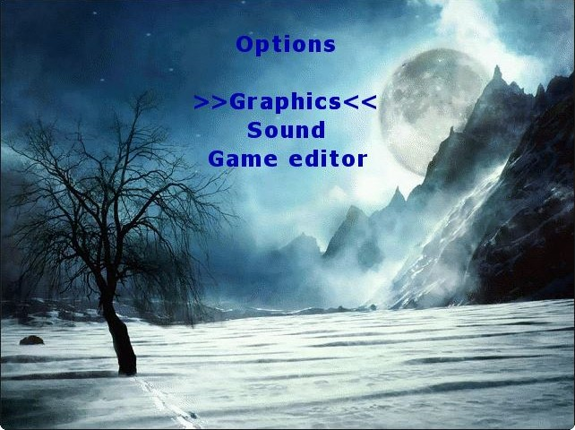
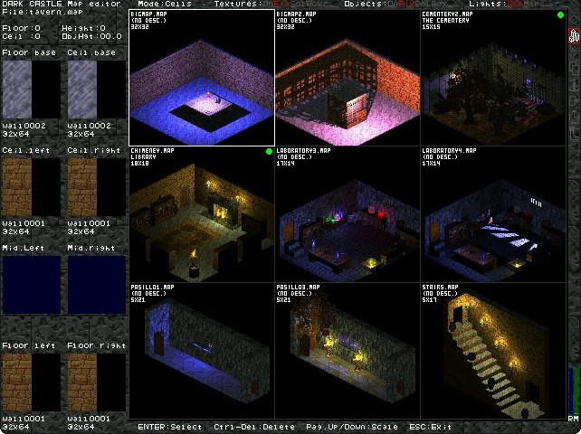
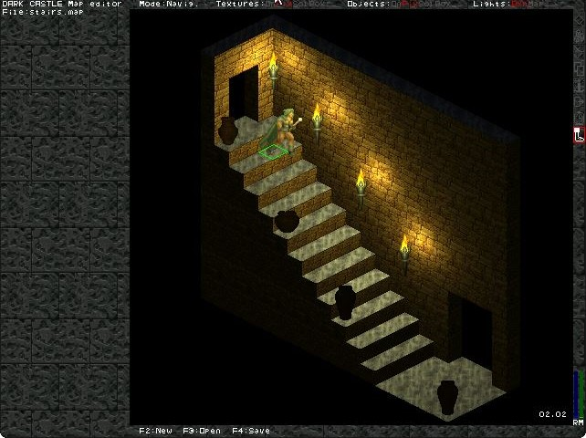
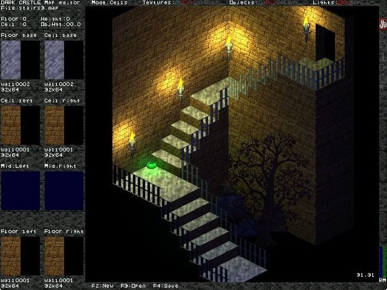
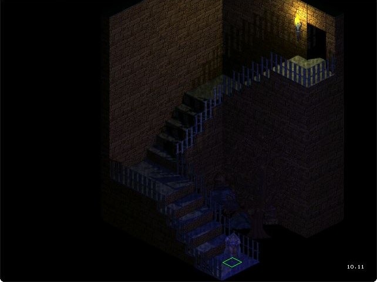
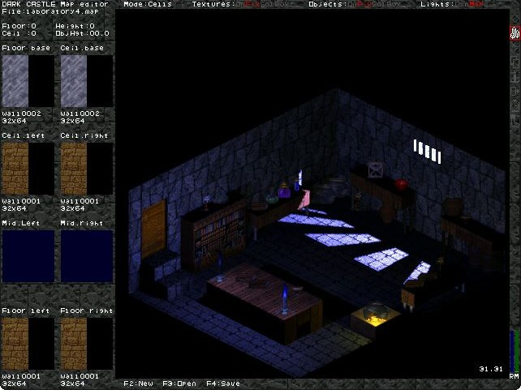
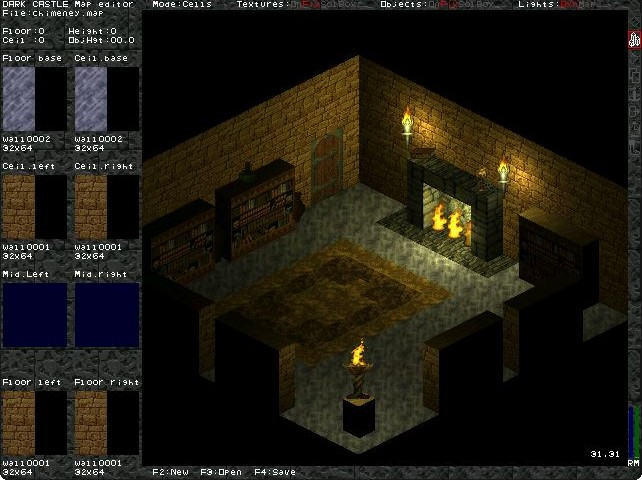
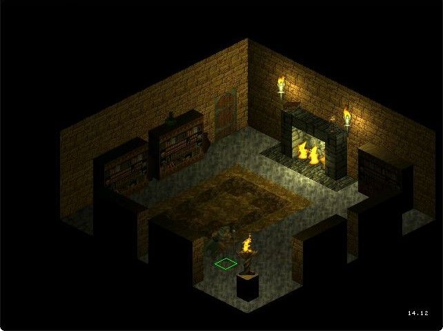
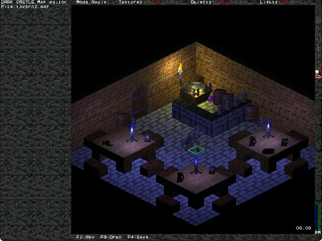

# Dark Castle

**Dungeon crawler on isometric perspective**

This is a dungeon crawler game with an isometric perspective, featuring light sources and shadows. The game includes a level editor, allowing players to design and create various scenes within the game itself.

Here are the features supported by the game engine:

- 3D rendering of textures and sprites with isometric perspective.
- The scene is divided into squares, with each square having defined floor and ceiling heights. This allows for lower, mid, and upper textures for each square, plus an additional texture for the floor, similar to the old Doom game engine.
- Up to nine different light sources can be defined in each scene, along with ambient light.
Shadows are depicted for static elements in the scene. However, the shadow algorithm only calculates shadows for static elements; characters and moving objects do not project shadows.
- Rendering of sprites for objects, which can be static or animated (if the object has multiple sprites).
- Rendering of playable characters that can navigate through the scenes.
- Doors that can be opened and closed, connecting different scenes.

The rendering of scenes is done without the aid of 3D graphics libraries (OpenGL or similar); everything is implemented and calculated pixel by pixel. This is why the shadow algorithm is not dynamic and cannot render moving objects, as the calculation of shadows is computationally intensive and cannot be done in real-time (it is pre-calculated and used when the scene is rendered).

All the textures seen in the screenshots come from Doom, Doom II, Heretic, and Hexen computer games. These games are from the 90s, but their graphical resources are not free, so I cannot upload them to this repository. Also, the background image on the menu screens comes from DevianArt website, but I do not know who is the author and I cannot include credits for it.

The game is developed using FreeBASIC (version 0.18) and is not fully finished. There are not any enemies or interactive objects; only navigation through the scenes is fully functional.

## Screenshots

Main menu:

Choose entry point on he adventure:

Options menu:

Credits screen:

Directory 1:

Directory 2:

Cementery map 1:

Cementery map 2:

Corridor map 1:

Corridor map 2:

Downstairs map 1:

Downstairs map 2:

Entrance map 1:

Entrance map 2:

Entrance map 3:

Entrance map 4:

Laboratory map 1:

Laboratory map 2:

Laboratory map 3:

Laboratory map 4:

Laboratory map 5:

Library map 1:

Library map 2:

Portal map 1:

Portal map 2:

Tavern map 1:

Tavern map 2:

Tavern map 3:

Shadow testing 1:

Shadow testing 2:

